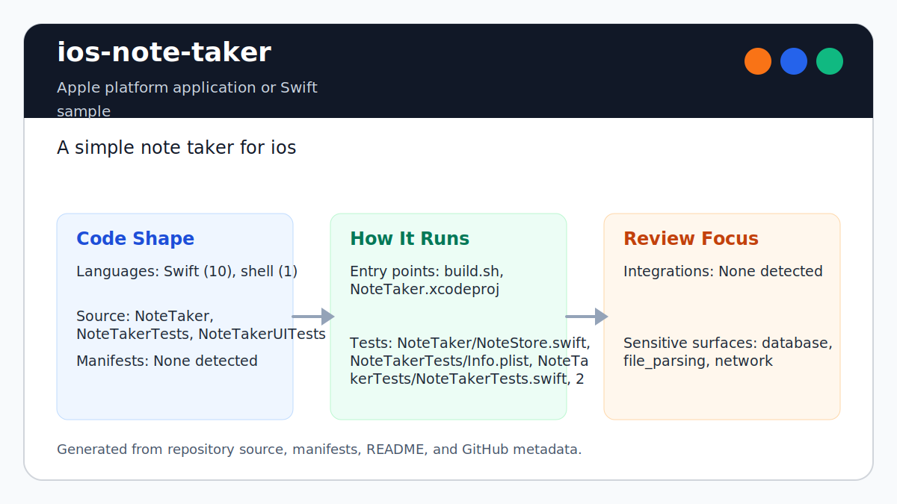

# ios-note-taker

<!-- README-OVERVIEW-IMAGE -->


## Overview

`garethpaul/ios-note-taker` is an Apple platform application or Swift sample. A simple note taker for ios

This README is based on the checked-in source, manifests, scripts, and repository metadata on the `master` branch. The project language mix found during review was: Swift (10), shell (1).

## Repository Contents

- `CHANGES.md` - concise history of maintenance changes
- `README.md` - project overview and local usage notes
- `build.sh`
- `Makefile` - local verification entry point
- `NoteTaker` - source or example code
- `NoteTaker.xcodeproj` - Xcode project file
- `NoteTakerTests` - source or example code
- `NoteTakerUITests` - source or example code
- `SECURITY.md` - security reporting and disclosure guidance
- `scripts/check-baseline.py` - static note persistence and project verifier
- `VISION.md` - project direction and maintenance guardrails

Additional scan context:

- Source directories: NoteTaker, NoteTakerTests, NoteTakerUITests
- Dependency and build manifests: none detected
- Entry points or build surfaces: `make check`, build.sh, NoteTaker.xcodeproj
- Test-looking files: NoteTaker/NoteStore.swift, NoteTakerTests/Info.plist, NoteTakerTests/NoteTakerTests.swift, NoteTakerUITests/Info.plist, NoteTakerUITests/NoteTakerUITests.swift

## Getting Started

### Prerequisites

- Git
- macOS with Xcode for building Apple platform projects
- Python 3 for local static verification on non-macOS hosts

### Setup

```bash
git clone https://github.com/garethpaul/ios-note-taker.git
cd ios-note-taker
make lint
make test
make build
make check
```

The checked-in project has no external dependency manifest. Use Xcode for full builds and `make check` for static verification on hosts without Xcode.

## Running or Using the Project

- Open `NoteTaker.xcodeproj` in Xcode, choose the app or sample scheme, and run it on the matching simulator/device.
- Run `./build.sh` when the required platform toolchain is installed. Set
  `SIMULATOR_NAME` to override the legacy default simulator.
- Note title normalization trims titles and falls back to `Untitled` through a model helper covered by focused unit assertions. Decoded title values use the same fallback for archived blank titles.
- Note lookup rejects invalid table indexes before configuring visible cells.
- Note delete results report whether the store actually removed a row before the table view deletes it.
- Reference delete results report whether the requested note object was removed.
- The mini logo is scoped to each navigation item title view instead of being
  added as a navigation-controller overlay.
- Notes are local app data stored through `NoteStore.plist` in the app documents area with platform file protection applied after successful saves. If the documents path is unavailable, the store keeps an empty in-memory list instead of writing to a fallback path. The app does not sync, upload, or analyze note content.

## Testing and Verification

Run the local static baseline:

```bash
make lint
make test
make build
make check
```

The `lint`, `test`, and `build` targets intentionally alias the static baseline
on hosts without the legacy Xcode toolchain, so the standard local gate commands
stay available while preserving the single source of truth.

The baseline runs `scripts/check-baseline.py`, parses plist/storyboard/scheme XML, checks Xcode metadata, verifies title normalization tests, decoded title fallback behavior, guarded note lookup, delete result handling, reference delete result handling, navigation logo title view ownership, local note persistence hardening, archive documents path guards, archive file protection, source inventory, no note-content logging, and no network/sync/upload/analytics behavior.

For full legacy verification on macOS, run `./build.sh`, Xcode's test action, or `xcodebuild test` with the appropriate scheme and destination.

When the required SDK or runtime is unavailable, use static checks and source review first, then verify on a machine that has the matching platform toolchain.

## Configuration and Secrets

- No required secret or credential file was identified in the repository scan. If you add integrations later, keep secrets out of git.
- Keep signing files, local xcconfig files, and environment files out of git.

## Security and Privacy Notes

- Notes can contain sensitive personal information. Keep note content local by default, avoid logging note content, and require explicit design before adding sync, upload, analytics, or export behavior.
- `scripts/check-baseline.py` verifies local persistence saves, archive file protection, archive fallback behavior, storyboard cast guards, invalid hex fallback, and static privacy guardrails.

## Maintenance Notes

- This looks like an Apple platform project or sample. Xcode, Swift, CocoaPods, and deployment target versions may need to match the original project era.
- See `SECURITY.md` for vulnerability reporting and safe research guidance.
- See `VISION.md` for project direction and contribution guardrails.
- See `docs/plans/2026-06-09-decoded-title-normalization.md` for the decoded title normalization guardrail.
- See `docs/plans/2026-06-09-note-lookup-index-guard.md` for the note lookup guardrail.
- See `docs/plans/2026-06-09-note-delete-result-guard.md` for the note delete result guardrail.
- See `docs/plans/2026-06-10-note-reference-delete-result.md` for the reference delete result guardrail.
- See `docs/plans/2026-06-09-navigation-logo-title-view.md` for the navigation logo title view guardrail.
- See `docs/plans/2026-06-09-make-gate-aliases.md` for the local gate alias guardrail.
- Run `make lint`, `make test`, `make build`, and `make check` before pushing changes to Swift sources, plist/storyboard/scheme files, persistence behavior, build scripts, or privacy documentation.

## Contributing

Keep changes small and tied to the project that is already present in this repository. For code changes, document the toolchain used, avoid committing generated dependency directories or local configuration, and update this README when setup or verification steps change.
